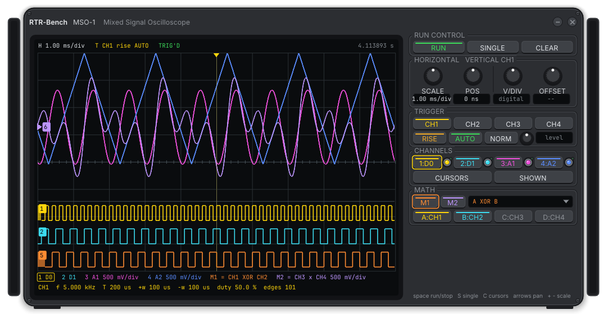
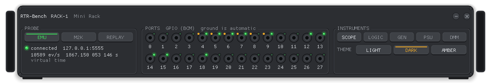
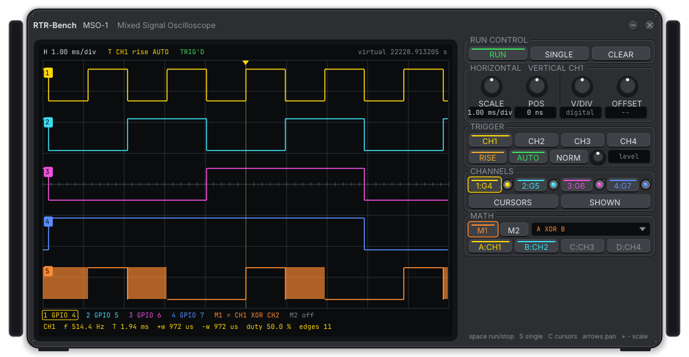

# RTR-Bench — Real-time Raspberry Bench

A bench of virtual instruments for the [RTR-OS](https://github.com/HermesSilva/RTR-OS) real-time operating system and for any 3.3 V / 5 V target: oscilloscope, logic analyzer, waveform generator, DC power supply and multimeter, each one drawn as a real instrument in its own window, wired by hand to the pins of the device under test.

RTR-Bench talks to a **probe**. Two probes are planned:

- the **emulator probe**: the `rtr-scope` device inside the [qemu-pi4](https://github.com/HermesSilva/qemu-pi4) emulator, which streams every GPIO transition of the emulated Raspberry Pi 4 and drives its input pins;
- the **ADALM2000 probe**: the Analog Devices ADALM2000 through [libm2k](https://github.com/analogdevicesinc/libm2k), for the physical board — 16 digital lines at 100 MS/s, two analog inputs, two waveform outputs and a power supply.

The same screens, the same recordings and the same measurements apply to both, so a capture of the emulator can be compared with a capture of the real board.

The project is at an early stage. The [Current state](#current-state) section says exactly what works.

## Contents

- [Design](#design)
- [Current state](#current-state)
- [Repository layout](#repository-layout)
- [Required tools](#required-tools)
- [Build](#build)
- [Run](#run)
- [Coding rules](#coding-rules)
- [Roadmap](#roadmap)
- [License](#license)

## Design

The full plan, with the reason behind each choice, is in [`docs/PLANO.md`](docs/PLANO.md) (in Portuguese, the language of the planning discussion). In short:

| Topic | Decision |
|-------|----------|
| Language and toolkit | C++17, Dear ImGui + ImPlot + imgui-knobs on GLFW and OpenGL 3.3. One code base for Windows and Linux |
| Look | Every instrument looks like a bench instrument: dark chassis, screen with graticule and readouts, rotary knobs, keys, connectors. No stock widgets are visible |
| Windows | One operating-system window per instrument, undecorated, with a transparent framebuffer so the window is cut to the shape of the chassis. Windows can be placed on any monitor |
| Rack | A small rack window shows the ports of the target (GPIO 0–27 of the Pi, DIO 0–15 of the ADALM2000), selects the probe and opens the instruments |
| Wires | Click a port of the rack or a connector of an instrument to run a wire between them. Ground is automatic and never shown. Where the system allows it (Windows, X11) the wire is drawn across the desktop in an overlay window; elsewhere each end shows a plug with the name of the other end |
| Probe | An abstract `Probe` with declared capabilities (ports, can observe, can drive, analog, time resolution). Drivers: emulator, ADALM2000, replay of a recording |
| Analog | No pretend voltages: analog channels exist only where the probe has them. On the emulator everything is logic |
| Time | Every sample and event carries a time in nanoseconds of the probe clock. On the emulator this is virtual time, and the screen says so |
| Portable | No installer. Everything the program writes (settings in JSON, recordings, exports, logs) goes to a `.RTR-Bench` folder next to the executable |
| Themes | Light, Dark and Amber, as in the RTR-OS web interface |

## Current state

Stage 2 of the plan: the rack and the mixed-signal oscilloscope, on the emulator or on the demo probe.







- One process, one window per instrument: undecorated, transparent framebuffer, the chassis drawn with handles, bevel, header and window controls; drag by the panel. Fonts embedded in the executable (Inter, JetBrains Mono, DSEG7).
- `Probe` interface and the **emulator probe**: a thread connects to the `rtr-scope` device (TCP, reconnects by itself), parses the stream (today's format and the planned version 2) and hands the events to the interface through a lock-free queue.
- The **rack**: probe keys and state, event rate and virtual clock, the 28 GPIOs of the header as jacks with a level LED and an activity mark, keys that open the instruments, the three themes.
- **Wires** from either end: click a jack on the rack and then a channel jack on an instrument, or the other way round; while a wire is being made the cable follows the mouse across the desktop (Esc cancels); clicking a wired channel key again removes the wire. On Windows and X11 every wire is a **cable drawn across the desktop** — a hanging curve with shadow and plugs, in its own always-on-top, click-through window — so it goes over whatever is between the rack and the instrument. The WIRES key on the rack hides them, and they are hidden whenever no window of the bench has the focus, so they never sit over other applications. On Wayland (no window positions) the ends show the plug and the port name instead.
- The **demo probe** (DEMO key on the rack): synthetic signals with no target — an 8-bit counter and a PWM on digital ports, a sine, a triangle, a ramp and a noisy sine on analog ports sampled at 1 MS/s. It shows the bench without hardware and stands in for the analog channels until the ADALM2000 arrives.
- The **oscilloscope**: four channels, digital or analog according to the port wired; 1-2-5 time base from 10 ns/div to 10 s/div, position; volts/div (10 mV to 10 V) and offset per analog channel; trigger by channel, slope and mode (auto, normal, single), with a level knob for an analog source; run/stop; memory of a million transitions or samples per channel, dense regions drawn as bands or min/max columns; cursors with Δt and 1/Δt; measurements of the selected channel (digital: frequency, period, widths, duty, edges; analog: Vpp, Vmax, Vmin, Vmean, Vrms, frequency, period); keyboard (space, S, C, arrows, + −).
- **Math channels** M1 and M2: new channels computed from a formula over up to four variables A–D, each variable any input channel or the other math channel. The formula comes from a combo grouped by kind and number of inputs — digital (NOT, AND, OR, XOR, NAND, NOR, XNOR, A AND NOT B, SR and D latches, three-input AND/OR/XOR, majority, gating, multiplexer, four-input AND/OR, parity, 2-of-4, (A AND B) OR (C AND D)) and analog (negation, absolute value, square, sum, difference, product, quotient, average, min, max, three- and four-input sums and averages, A×B − C×D, (A − B)/(C − D)). Variables of the wrong kind are swapped for the next wired channel of the right kind. Math channels have measurements, cursors, volts/div and offset like the others; the readout line shows the expression ("M1 = CH1 XOR CH2").
- `rtr-probe-dump`: console tool that prints what the probe sends; `rtr-bench --probe demo --open scope --wire scope:1=9 --math "1=A XOR B" --screenshot scope=FILE.png` starts on a probe, opens, wires, enables a formula and saves a window with its transparent margins (`scripts\screenshot.ps1`).
- Windowless tests (Catch2): protocol parser, event queue, port state, trace ring, trigger search, measurements, time base, formulas, themes.

Not there yet: the other instruments, settings persistence.

## Repository layout

```
CMakeLists.txt       build: dependencies (FetchContent), targets, warnings
cmake/               toolchain helpers
docs/PLANO.md        the plan: decisions, requirements, stages (Portuguese)
src/app/             main, rack, settings
src/core/            Probe interface, buffers, measurements, recording
src/probes/          emulator (rtr-scope), ADALM2000 (libm2k), replay
src/ui/              chassis, knobs, keys, screen, wires, overlay window
src/instruments/     one directory per instrument
resources/           fonts (embedded at build time)
tests/               tests without a window
scripts/             build.ps1 / build.sh, run, test
```

## Required tools

Windows:

- [LLVM](https://releases.llvm.org/) (clang, lld, clang-tidy), with the Visual Studio Build Tools or Visual Studio installed for the C++ standard library and the Windows SDK;
- [CMake](https://cmake.org/) 3.24 or newer and [Ninja](https://ninja-build.org/);
- Git.

Linux (Ubuntu shown):

```sh
sudo apt install build-essential cmake ninja-build git libgl-dev libx11-dev libxrandr-dev libxinerama-dev libxcursor-dev libxi-dev libwayland-dev libxkbcommon-dev wayland-protocols pkg-config
```

The dependencies (GLFW, Dear ImGui, ImPlot, imgui-knobs, nlohmann/json, Catch2) are fetched by CMake at configure time; libm2k is optional and comes from the Analog Devices packages.

## Build

```powershell
scripts\build.ps1            # Windows: build\rtr-bench.exe
```

```sh
scripts/build.sh             # Linux: build/rtr-bench
```

Both run CMake with Ninja in `build/`, with warnings as errors.

## Run

```powershell
scripts\run.ps1
```

The rack opens first. Choose the probe, open an instrument and wire it to a port. To see the emulated RTR-OS, start it with `scripts\run-web.ps1 -Scope` in the RTR-OS repository: the probe listens on port 5555 (bound to every address, because WSL only mirrors wildcard listeners to Windows). The probe accepts one client at a time.

```powershell
build\rtr-probe-dump.exe 127.0.0.1 5555 3    # prints three seconds of probe traffic
```

## Coding rules

- C++17, `-Wall -Wextra -Werror -Wconversion -Wshadow`; clang-tidy on our code (third-party code is exempt).
- Everything in the product — interface, messages, code, comments, scripts — is in English. The planning documents are in Portuguese.
- Acquisition runs in its own thread and never blocks the interface.
- Nothing with the stock look of Dear ImGui reaches the user: every visible element is drawn by the `ui/` library.

## Roadmap

| Stage | Delivery |
|-------|----------|
| 0 | Repository, build, a transparent window cut to the shape of a chassis, on Windows and Linux |
| 1 | `Probe` and the emulator probe (observe only); rack with live port LEDs |
| 2 | Digital oscilloscope: time base, trigger, cursors, measurements, Run/Stop/Single |
| 3 | Wires inside the windows; desktop overlay on Windows and X11 |
| 4 | Multimeter (digital functions) |
| 5 | Probe with input drive (`rtr-scope` in the qemu-pi4 fork); digital generator; logic power supply |
| 6 | Logic analyzer with buses |
| 7 | Recording, replay, export (VCD, CSV, PNG) |
| 8 | ADALM2000 probe: digital, analog, generator, supply, DMM |
| 9 | Polish: HiDPI, keyboard, persistence, AppImage |

Later: counter and interval meter, jitter analyzer, sensor simulators, variable voltage source, bus masters and protocol decoders, spectrum and Bode analyzers, electronic load.

## License

Apache License 2.0 — see [`LICENSE`](LICENSE). Third-party components and their licenses are listed in [`THIRD_PARTY.md`](THIRD_PARTY.md).
